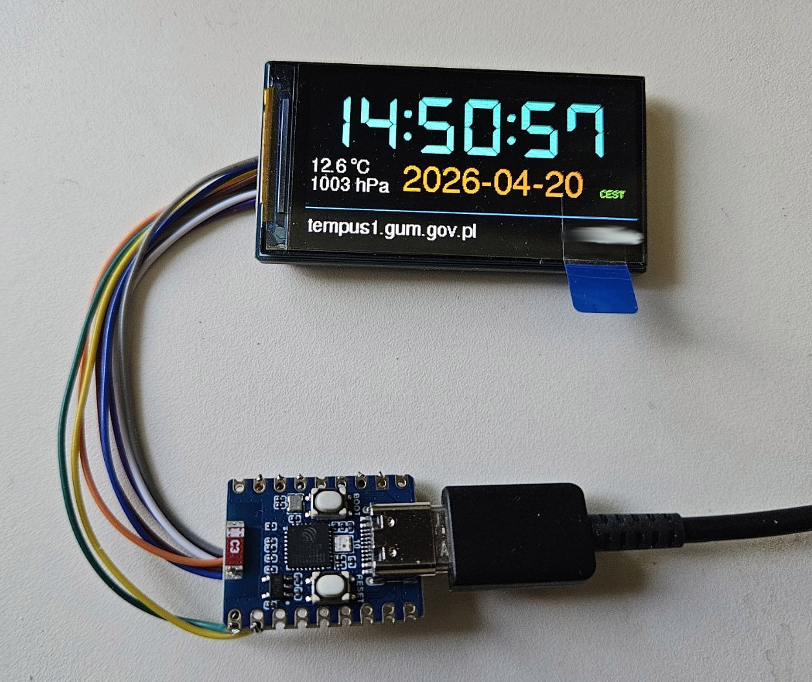

# NTP-clock-TFT v3
The clock retrieves time from NTP and weather data from https://open-meteo.com.

It displays the local time and date, as well as the temperature and pressure from the location specified in the configuration.

 

## Use

1. ESP32C3 micro
2. Waveshare 1.9 inch LCD Module 170x320 pixels

## Connection:

ESP32 – LCD 
GND - GND 
3V3 - VCC 
3V3 - BL 
GPIO3 – RST 
GPIO2 – DC 
GPIO7 – CS 
GPIO4 - CLK 
GPIO6 - DIN 

<i>This program was designed for the Arduino IDE C++.</i>
